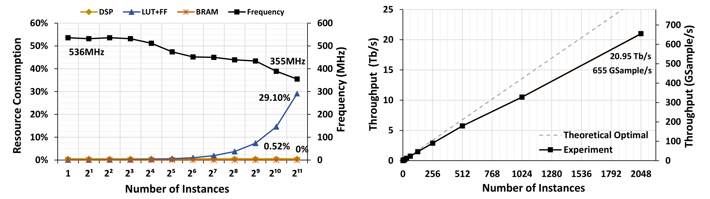
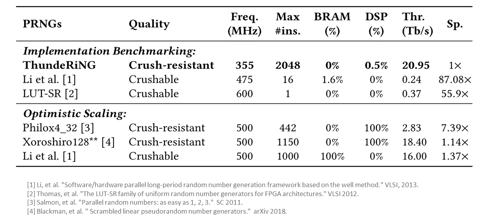
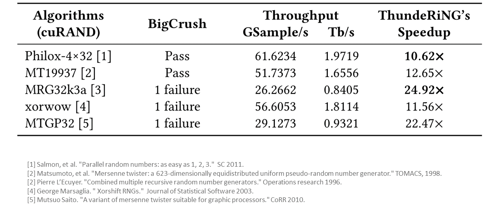
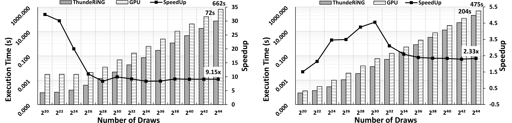

[](./LICENSE)
[](https://github.com/Xtra-Computing/ThundeRiNG/issues)

# Fast Multiple Independent Random Number Sequences Generation on FPGAs

## What's New?

* ThunderRiNG is invited to be presented at [XACC Tech Talk](https://xilinx.github.io/xacc/xacc_tech_talks.html). [[Slides]](docs/slides.pdf)

* ThunderRiNG is accepted by [ICS 2021](https://ics21.github.io/program). [[Paper]](docs/paper.pdf)

## Introduction

**Want to get 655 billion random numbers per second on a single FPGA?**

ThundeRiNG is a high performance and high quality FPGA-based pseudo random number generator (PRNG) that can concurrently generate massive number of independent sequences of random numbers. Our algorithm enables it to **pass the most stringent empirical statistical tests**, BigCrush (TestU01). 
Meanwhile, with our state sharing and decorrelation methods, it **consumes 0 BRAM and only 0.52% DSPs** with any number of sequences to be generated and reserves nearly all these precious hardware resources to application processing logic, which further give the possibility to adopt more complex applications (i.e. Monte Carlo simulations) to FPGAs. 
In our case studies, benefiting from ThundeRiNG's high performance and the pipelined generation of random number with the application processing, the two applications on FPGA platform show a **significant performance speedup** (up to 9.15x and 2.33x) over the corresponding implementations on NVIDIA P100 GPUs.


## Prerequisites

**Supported FPGA accelerator cards:**

|FPGA Card    | Shell Version |
|-|-|
| Alveo U250 | xilinx_u250_gen3x16_xdma_3_1_202020_1|
| Alveo U280 | xilinx_u280_xdma_201920_3 |


**Compiler:**

g++ 9 (software code), Vitis 2020.2 (hardware code)

**Environment setup:**

* Install gcc/g++ 9 using apt tools
``` shell
sudo add-apt-repository ppa:ubuntu-toolchain-r/test
sudo apt update
sudo apt install gcc-9 g++-9
```
* Following this [link](https://www.xilinx.com/support/download/index.html/content/xilinx/en/downloadNav/vitis.html) to download and install Vitis 2020.2.
* Install the XRT environment and U250's development shell from [here](https://www.xilinx.com/products/boards-and-kits/alveo/u250.html#gettingStarted).
* **[option]** To support massive number of instances, we expand the limitation of maximum number of OpenCL kernels in the original XRT. Please go [here](https://github.com/HongshiTan/XRT) to get and install our modified XRT runtime environment.


## Run the Code

``` shell 
# setup Vitis/XRT env
export LIBRARY_PATH=$LIBRARY_PATH:/usr/lib/x86_64-linux-gnu
source /path/to/xrt/setup.sh
source /path/to/vitis/2020.2/settings64.sh

# clone the code
git clone git@github.com:Xtra-Computing/ThundeRiNG.git

# compile the first demo
cd ThundeRiNG/fpga/rng
make all -j4

# [option] valid the design using waveform viewer
./run_hw_emu.sh path/to/xclbin
```

_**More demo is coming soon...**_


## Results 

### I. Quality

| Statistical Tests  | Correlation | Results |
|-|-|-|
| BigCrush ([TestU01](https://en.wikipedia.org/wiki/TestU01)) | intra-stream | Pass|
| [PractRand](http://pracrand.sourceforge.net/) | intra-stream | >8TB|
| BigCrush on interleaved sequence | inter-stream | Pass |
| [PractRand](http://pracrand.sourceforge.net/) on interleaved sequence| inter-stream | >8TB|
| Pairwise correlation analysis | inter-stream | <3e-5 |
| [Hamming weight dependency](https://xoshiro.di.unimi.it/hwd.php) | inter-stream | >1e+14| 


### II. Throughput

**a. Resource consumption and Throughput**

 Following graph shows ThundeRiNG's resource consumption and throughput with increasing number of instances.



**b. Throughput speedup over FPGA-based PRNGs** 

Comparison of throughput, quality and resource utilization of the state-of-the-art FPGA-based works and CPU-based designs with ThundeRiNG. Even with the most optimistic scaling with the available hardware resources, ThundeRiNG still can **outperform** existing PRNGs on FPGAs.



**b. Throughput speedup over GPU-based PRNGs** 

Throughput of various GPU PRNG schemes running on NVIDIA Tesla P100 compared to ThundeRiNG's throughput. Ours is at least **10x** faster than them.



### III. Case Study

Comparison of execution time of estimation of pi and Monte Carlo option pricing on FPGA with ThundeRiNG with the corresponding GPU-based solution.




## Citation
If you find this repository useful, please cite our [paper](https://dl.acm.org/doi/10.1145/3447818.3461664):

```
@inproceedings{tan2021thundering,
  title={ThundeRiNG: generating multiple independent random number sequences on FPGAs},
  author={Tan, Hongshi and Chen, Xinyu and Chen, Yao and He, Bingsheng and Wong, Weng-Fai},
  booktitle={Proceedings of the ACM International Conference on Supercomputing},
  pages={115--126},
  year={2021}
}
```

## Key members
* Hongshi Tan, Xinyu Chen (NUS)
* Advisor: [Bingsheng He](https://www.comp.nus.edu.sg/~hebs/) and [Weng-Fai Wong](https://www.comp.nus.edu.sg/~wongwf/), NUS
* Collaborators: [Yao Chen (ADSC)](https://microideax.github.io/)


## Acknowledgement
* [Xilinx Adaptive Compute Clusters (XACC) program](https://www.xilinx.com/support/university/XUP-XACC.html)
* Singapore MoE Tier 2 grant (MOE2017-T2-1-122)
 

## File structure

``` shell 
├── cmake
├── common
├── cpu          # test code on CPUs
├── emulation
├── fpga         # FPGA implementation
├── gpu          # test code on GPUs
├── misc
└── test         # code for statistical tests
```

